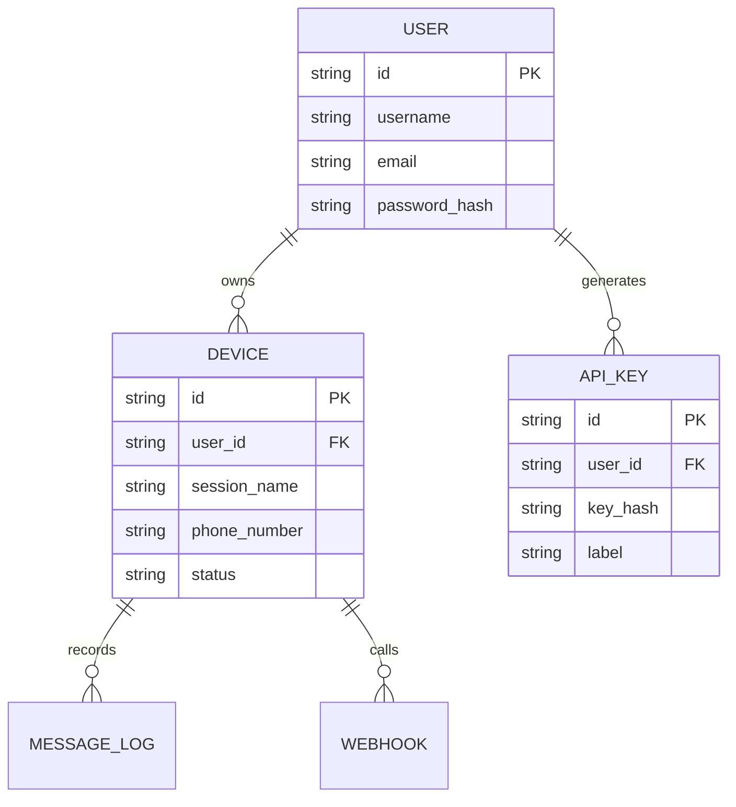

# Roadmap Pengembangan: Whatsapp API Multi-User & Multi-Device

Proyek ini bertujuan untuk meningkatkan `wa-services` menjadi platform berskala produksi yang mendukung banyak pengguna, banyak perangkat per pengguna, dan akses API untuk banyak klien pihak ketiga.

## 1. Arsitektur Sistem

Sistem akan dikembangkan dengan arsitektur **Three-Tier**:
- **Frontend:** Dashboard berbasis Web (Next.js atau React) untuk manajemen user & device.
- **Backend:** Node.js (Express) dengan sistem antrian (Redis/Bull) untuk skalabilitas pengiriman pesan.
- **Database:** PostgreSQL untuk data relasional dan Redis untuk caching/session.

## 2. Fitur Utama

### A. Multi-User (SaaS Ready)
- Registrasi dan Login User (JWT + Refresh Token).
- Role-based Access Control (RBAC): Admin, Reseller, User.
- Pengaturan profil dan limitasi jumlah device per user.

### B. Multi-Device (WhatsApp Session Management)
- Kemampuan menghubungkan lebih dari satu akun WhatsApp per user.
- Status real-time koneksi (Connected, Disconnected, Authenticating).
- Sinkronisasi status baterai dan info perangkat.

### C. Multi-Client API
- API Key management: Tiap user bisa membuat banyak API Key untuk aplikasi berbeda.
- Webhook management: URL webhook yang dapat dikonfigurasi per session atau per klien.
- Log API: Riwayat pengiriman pesan dan status pengiriman (terkirim, dibaca, gagal).

## 3. Tahapan Pengembangan (Roadmap)

### Fase 1: Fondasi & Migrasi Database
1. Migrasi penyimpanan sesi dari JSON ke Database (PostgreSQL).
2. Implementasi skema Database: `users`, `devices`, `api_keys`, `webhooks`, `messages_log`.
3. Integrasi autentikasi JWT.

### Fase 2: Robust Messaging & Webhooks
1. Implementasi Queue (Antrian) menggunakan Redis & BullMQ untuk mencegah overload saat broadcast.
2. Sistem Webhook yang lebih reliabel dengan fitur retry otomatis jika target webhook sedang down.
3. Media handler yang lebih baik (mendukung upload file via URL atau base64 secara aman).

### Fase 3: Dashboard & API Client Portal
1. Pembuatan Dashboard Admin & User.
2. Statistik penggunaan API (pesan harian, rate limit).
3. Halaman dokumentasi API interaktif (Swagger/OpenAPI).

### Fase 4: Optimasi & Keamanan
1. Rate Limiting per API Key untuk mencegah abuse.
2. IP Whitelisting untuk akses API tertentu.
3. Dockerization dan setup CI/CD untuk deployment otomatis.

## 4. Rencana Skema Database (Draft)

## 5. Teknologi yang Digunakan
- **Runtime:** Node.js (v18+)
- **Library WA:** `whatsapp-web.js` (atau migrasi ke `baileys` jika butuh performa lebih tinggi tanpa headless browser).
- **Database:** PostgreSQL & Redis.
- **Queue:** BullMQ.
- **Frontend:** Next.js + TailwindCSS.
